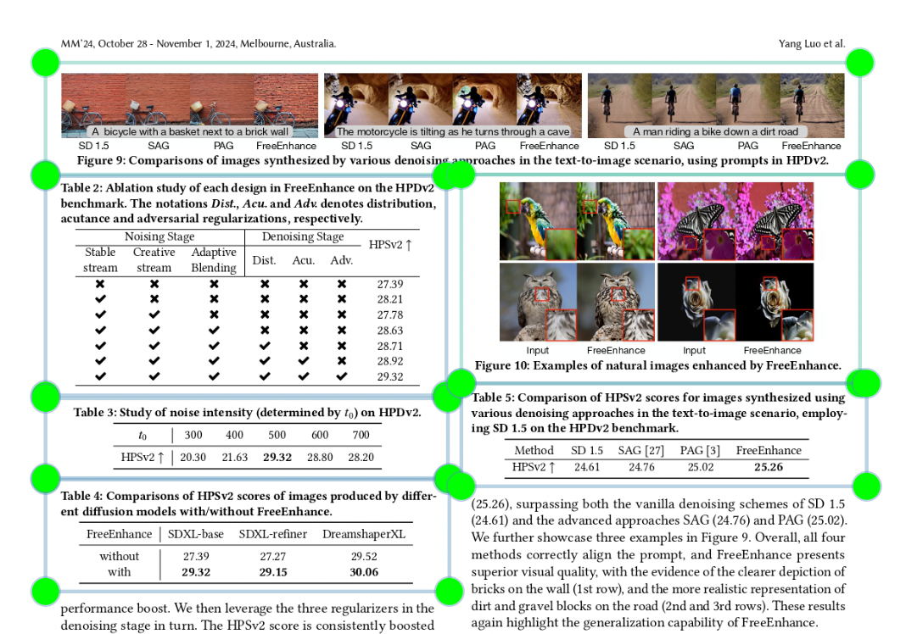

# Figure, table, and reference extraction 
This project implements the extraction of figures, tables, and references from a scientific research paper. 


## Data Preparation and Processing 
For data preparation, different objects were labelled as figures, tables, and references in 267 pages of scientific research papers (mainly in electrical engineering, physics, and computer science) using LabelImg. 



The data_processing.py file divides 80% of the data for training and 20% for validation. 
The images in the training set were augmented 5 times each, leading to a total of 1065 training images. The images in the validation set were left unaugmented so that the validation set remains truly unseen by the model. 

## Model Design 
The final.pt model was obtained by training the YOLOv5 object detection model (specifically the YOLOv5s model) with my own data and making alterations to the parameters. The hyperparameters for the final model was set to the default settings in the hyp.scratch-low.yaml in the YOLOv5 github, with an increased IoU of 0.4.

Other parameters involved:  
>Image resolution: 832 x 832  
>Batch: 16  
>Epochs: 80  

## Results 

The metrics for the final.pt model was as follows:  
Loss:  
>mAP_0.5:  
>mAP_0.5:0.95:  
>mAP_recall:  
>mAP_precision:

## Testing Method  
In order to test the final.pt model with other inputs, you can download and run the 'test_model.py' file with adjustments to the path to the model, path to the testing and output files, and selection of device. 

Change the directory to the final.pt model in:
```python
'model = torch.hub.load('ultralytics/yolov5', 'custom', path='path/to/installed/extraction.pt/model')' 
```

The output directory can also be changed in: 
```python
test_dir = 'directory/to/test/images'
output_dir = 'directory/to/save/annotated/pages'
objects_dir = 'directory/to/save/extracted/images/as/separate/files'
```


