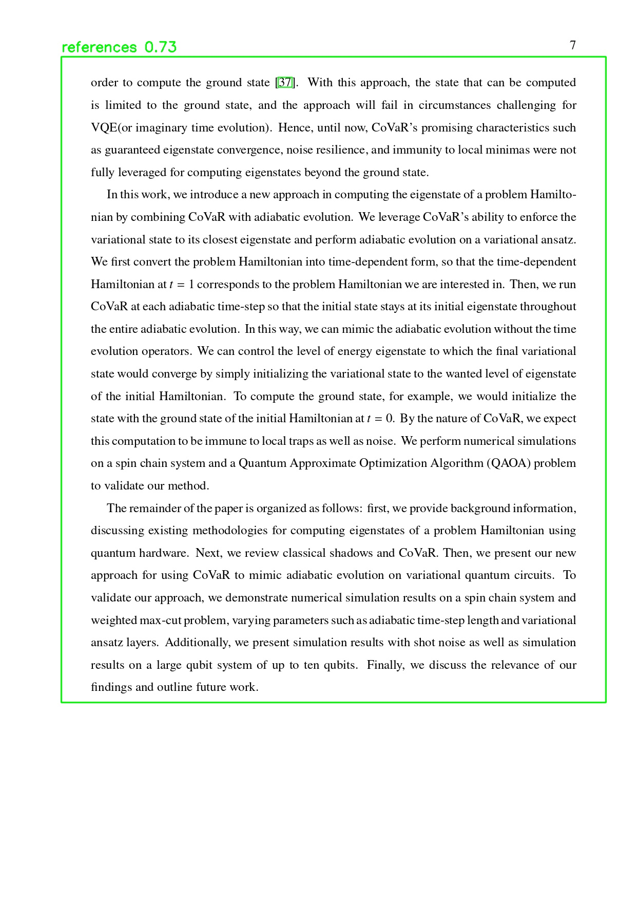
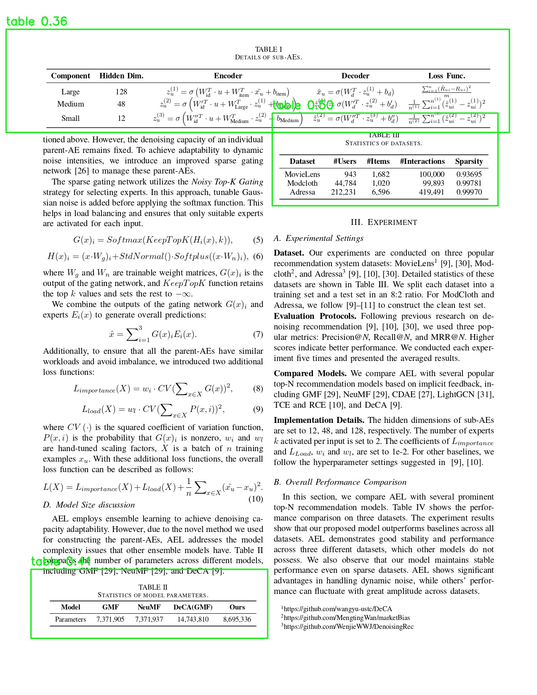

# Figure, table, and reference extraction 
This project explores the extraction of figures, tables, and references from scientific research papers by using the YOLOv5 object detection training model. 


<p align="center">
  
</p>


## Data Preparation and Processing 
For data preparation, figures, tables, and references were labelled accordingly in 267 pages of scientific research papers (mainly in electrical engineering, physics, and computer science) using LabelImg. 

<p align="center">
  
</p>


The data_processing.py file divides 80% of the data for training and 20% for validation. 
The images in the training set were augmented 5 times each, leading to a total of 1065 training images. The images in the validation set were left unaugmented so that the validation set remains truly unseen by the model. 

## Model Design 
The `final_model` directory contains images of the training process, parameters of the model, and the final model itself - named as `final.pt`. 

`final.pt` was obtained by training the YOLOv5 object detection model (specifically the YOLOv5s model) with the following parameters: 
>Image resolution: 640 x 640  
>Batch: 16  
>Epochs: 80  
>IoU: 0.2  

## Results

### Metrics 
The specific metrics for the final.pt model was as follows:  
>Loss: 0.28
>mAP_0.5: 0.953
>mAP_0.5:0.95: 0.85
>mAP_recall: 0.91
>mAP_precision: 0.92
 
### Evaluation
Overall, figure and table detection were successful in most research papers, but there were a noticeable amount of false positive for references, especially for pages filled with texts only. 

<p align="center">
  
</p>

In order to decrease the number of false positives, increasing the confidence level from the default value of 0.5 to a higher value of 0.7 was considered. However, some extracted tables were often detected with low confidence score, so it was concluded that extracting false positives is better false negatives in this specific case. 

<p align="center">
  
</p>

## Usage of the model
In order to test the final.pt model with other inputs, you can download and run the 'test_model.py' file with adjustments to the path to the model, output files, and selection of device. 

Change the directory to the final.pt model in:
```python
'model = torch.hub.load('ultralytics/yolov5', 'custom', path='path/to/installed/extraction.pt/model')' 
```

The output directory can also be changed in: 
```python
test_dir = 'directory/to/test/images'
output_dir = 'directory/to/save/annotated/pages'
objects_dir = 'directory/to/save/extracted/images/as/separate/files'
```


